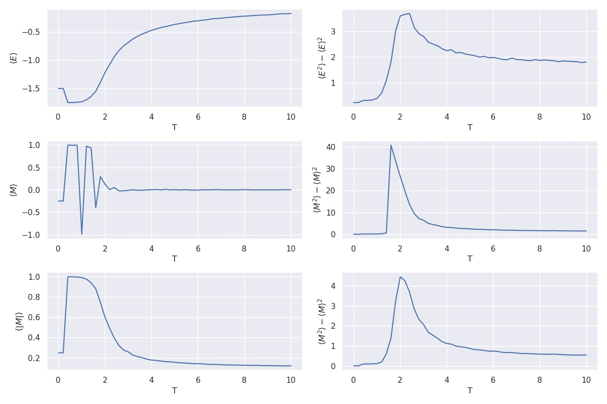

#Ising model using Monte Carlo

`Ising.py` is running a Monte Carlo simulation for a two-dimensional Ising model at zero magnetic field. 

The parameters can be set in the main code, `J = 1, kB = 1`.

The output figure:

##References:
[J. Kotze, "Introduction to Monte Carlo methods for an Ising Model of a Ferromagnet"](https://arxiv.org/abs/0803.0217)
